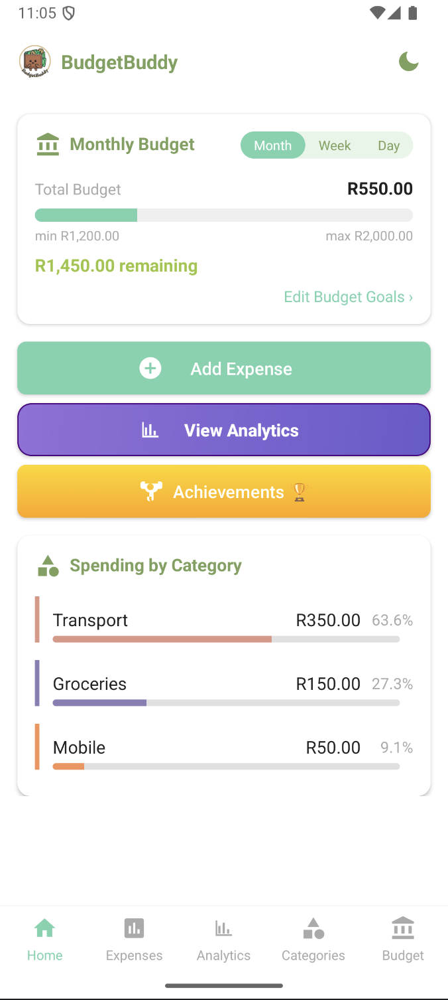
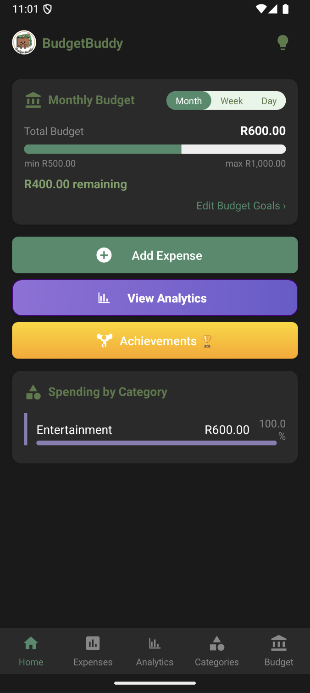
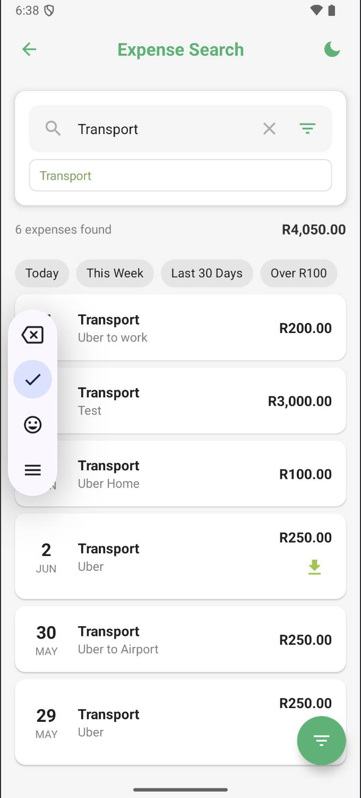
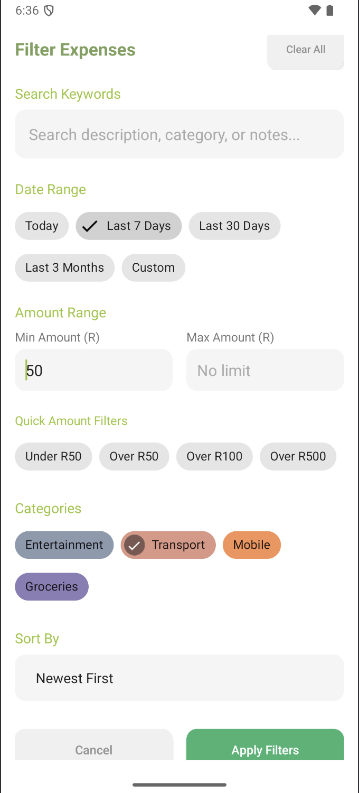
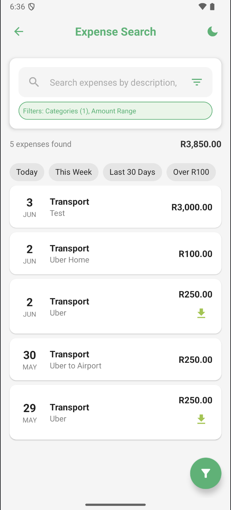

<a id="readme-top"></a>

<!-- BADGES -->
[![Contributors][contributors-shield]][contributors-url]
[![Forks][forks-shield]][forks-url]
[![Stargazers][stars-shield]][stars-url]
[![Issues][issues-shield]][issues-url]

<br />
<p align="center">
  
  <h1 align="center">BudgetBuddy</h1>
  <p align="center">
    Mobile Budget Tracking Application - Part 3
    <br />
    <a href="https://github.com/st10251759/Prog7313_POE_Part_2"><strong>View Repository »</strong></a>
<br><br>
<a href="https://youtu.be/PLACEHOLDER_LINK" target="_blank">
  
</a>
  </p>
</p>

## Table of Contents

- [Team Details](#team-details)
- [App Overview](#app-overview)
- [Part 3 Enhancements](#part-3-enhancements)
- [Built With](#built-with)
- [Getting Started](#getting-started)
  - [Prerequisites](#prerequisites)
  - [Installation (Installing and Running the APK)](#installation-installing-and-running-the-apk)
    - [Method 1: Using Android Studio Emulator](#method-1-using-android-studio-emulator)
    - [Method 2: Using Command Line](#method-2-using-command-line)
      - [For Windows](#for-windows)
      - [For macOS/Linux](#for-macoslinux)
    - [Troubleshooting](#troubleshooting)
- [Repository Contents](#repository-contents)
- [Functional Requirements (Part 3)](#functional-requirements-part-3)
- [Custom Features Implementation](#custom-features-implementation)
  - [1. Night Mode/Dark Theme Scheduler](#1-night-modedark-theme-scheduler)
  - [2. Smart Transaction Search & Filters](#2-smart-transaction-search--filters)
  - [3. Gamification System](#3-gamification-system)
- [Cloning the Project and Firebase Setup](#cloning-the-project-and-firebase-setup)
  - [Prerequisites](#prerequisites-1)
  - [Cloning Steps](#cloning-steps)
  - [Firebase Configuration](#firebase-configuration)
- [Architecture and Design Pattern](#architecture-and-design-pattern)
- [Database Implementation](#database-implementation)
- [Testing and CI/CD](#testing-and-cicd)
- [Functionality and App Usage](#functionality-and-app-usage)
  - [User Registration and Authentication](#user-registration-and-authentication)
  - [Expense Management](#expense-management)
  - [Visual Analytics and Reporting](#visual-analytics-and-reporting)
  - [Goal Tracking and Progress Monitoring](#goal-tracking-and-progress-monitoring)
- [Logging Implementation](#logging-implementation)
- [Future Requirements](#future-requirements)
- [Contributors](#contributors)

---

## Team Details

- **Student Numbers:** ST10251759 | ST10252746 | ST10266994
- **Student Names:** Cameron Chetty | Theshara Narain | Alyssia Sookdeo
- **Course:** BCAD Year 3
- **Module:** Programming 3C (PROG7313)
- **Assessment:** Portfolio of Evidence (POE) Part 3
- **GitHub Repository:** [https://github.com/st10251759/Prog7313_POE_Part_2](https://github.com/st10251759/Prog7313_POE_Part_2)

---

## App Overview

BudgetBuddy is a comprehensive mobile budget tracking application that empowers users to take control of their personal finances through intelligent expense tracking, goal setting, and visual analytics. Part 3 introduces advanced features including cloud synchronization, graphical insights, progress monitoring, and gamification elements that make financial management engaging and rewarding.

The app features a modern, user-friendly interface with customizable themes, allowing users to create personalized expense categories, set minimum and maximum monthly budget goals, and track spending patterns through detailed visualizations. Users can monitor their financial health through an interactive progress dashboard that highlights overspending categories and provides actionable insights for better financial decision-making.

---

## Part 3 Enhancements

### Core Requirements Implemented

**Advanced Visual Analytics:**
- Interactive graphs showing spending per category over user-selectable periods
- Visual progress indicators displaying performance against minimum and maximum spending goals
- Real-time dashboard highlighting overspending categories with color-coded alerts

**Cloud Data Synchronization:**
- Complete migration to Firebase Firestore for online data storage
- Multi-device synchronization ensuring data consistency across platforms
- Automatic backup and restore functionality for data security

**Enhanced Goal Management:**
- Comprehensive goal tracking system with minimum and maximum spending targets
- Visual progress monitoring showing monthly performance trends
- Smart notifications and alerts for budget threshold breaches

### Custom Feature Innovations

**1. Night Mode/Dark Theme Scheduler**
- Automatic dark mode activation based on time of day preferences
- Manual toggle functionality for immediate theme switching
- Eye strain reduction for comfortable viewing in different lighting conditions
- Consistent design language maintained across both light and dark themes

**2. Smart Transaction Search & Filters**
- Advanced keyword-based expense search functionality
- Multi-criteria filtering (date ranges, amounts, categories)
- Quick access to specific transactions with intelligent search suggestions
- Enhanced user experience for managing large expense datasets

**3. Comprehensive Gamification System**
- Streak tracking to encourage consistent expense logging habits
- Achievement badges for various milestones and behaviors
- Points system rewarding different user actions and achievements
- Progress levels with meaningful rewards and recognition
- Detailed statistics tracking user engagement and financial habits

---

## Built With

<p align="center">
  
  
  
  
  
</p>

- **Kotlin** - Primary programming language for Android development
- **Android Studio (v32)** - Integrated development environment
- **Firebase Authentication** - Secure user authentication and authorization
- **Firebase Firestore** - Cloud-based NoSQL database for real-time data synchronization and storage
- **GitHub Actions** - Automated testing and continuous integration pipeline
- **Material Design Components** - Modern UI/UX following Google's design principles

---

## Getting Started

### Prerequisites

- Android Studio (latest version recommended)
- Android SDK with API level 24 (Android 7.0) or higher
- Minimum 4GB RAM and sufficient storage space
- Stable internet connection for Firebase integration
- Java Development Kit (JDK) 8 or higher
- Git for version control

---

### Installation (Installing and Running the APK)

#### Method 1: Using Android Studio Emulator

1. **Download the APK**
    - Navigate to the project's GitHub repository releases section
    - Download the latest `BudgetBuddy-v3.0-release.apk` file
    - Save to an easily accessible location on your computer

2. **Setup Android Studio Emulator**
    - Launch Android Studio
    - Open Device Manager via "Tools" > "Device Manager"
    - Create a new virtual device if none exists (recommended: Pixel 4 with API 29+)

3. **Install and Launch**
    - Start your preferred emulator
    - Drag and drop the APK file onto the emulator screen
    - Grant installation permissions when prompted
    - Launch BudgetBuddy from the app drawer

#### Method 2: Using Command Line

##### For Windows

```bash
cd C:\Users\YourUsername\AppData\Local\Android\Sdk\platform-tools
adb install "path\to\BudgetBuddy-v3.0-release.apk"
adb shell am start -n com.firstproject.prog7313_budgetbuddy/.MainActivity
```

##### For macOS/Linux

```bash
cd ~/Library/Android/sdk/platform-tools
./adb install /path/to/BudgetBuddy-v3.0-release.apk
./adb shell am start -n com.firstproject.prog7313_budgetbuddy/.MainActivity
```

#### Troubleshooting

- **Installation Failed:** Ensure "Install from Unknown Sources" is enabled in emulator settings
- **App Crashes:** Verify emulator is running Android 7.0 (API 24) or higher
- **Firebase Connection Issues:** Check internet connectivity and ensure Google Play Services are available
- **Performance Issues:** Allocate at least 2GB RAM to the emulator for optimal performance

---

## Repository Contents

- **Complete Android Studio Project** - Full source code with modular architecture
- **Firebase Configuration Files** - Setup files for cloud integration
- **Automated Testing Suite** - Comprehensive unit and integration tests
- **GitHub Actions Workflows** - CI/CD pipeline configuration
- **APK Release Build** - Production-ready application package
- **Documentation** - Detailed technical documentation and user guides
- **Resource Assets** - Images, icons, and design resources

---

## Functional Requirements (Part 3)

### Core Visual Analytics Features

**Interactive Category Spending Graphs:**
- Dynamic charts displaying spending amounts per category over user-selectable periods
- Integration of minimum and maximum spending goals directly on graph visualizations
- Real-time updates reflecting new expense entries and budget modifications

**Progress Dashboard:**
- Visual representation of monthly spending performance against set goals
- Color-coded indicators showing categories exceeding, meeting, or falling short of targets
- Historical trend analysis showing spending patterns over multiple months

**Advanced Reporting:**
- Comprehensive expense summaries with filtering capabilities by date ranges
- Category-wise spending breakdowns with percentage distributions
- Export functionality for sharing financial reports and insights

### Enhanced Data Management

**Cloud-First Architecture:**
- Complete data storage migration to Firebase Firestore
- Real-time synchronization across multiple devices and platforms
- Automatic backup and restore capabilities ensuring data integrity

**Offline Capability:**
- Local caching for seamless operation without internet connectivity
- Intelligent sync when connection is restored
- Conflict resolution for data modified across multiple devices

---

## Custom Features Implementation

### 1. Night Mode/Dark Theme Scheduler

Our Dark Mode Scheduler enhances user experience by providing intelligent theme switching based on user preferences and environmental factors.

**Key Features:**
- **Automatic Time-Based Switching:** Configurable schedule for automatic dark mode activation during evening hours
- **Manual Override:** Instant theme toggle for immediate preference changes  
- **Eye Strain Reduction:** Dark theme optimized for comfortable viewing in low-light environments
- **Consistent Design:** Maintains visual hierarchy and branding across both light and dark themes

**User Benefits:**
- Reduced eye strain during different lighting conditions
- Enhanced usability at all times of day
- Personalized viewing experience with manual toggle option
- Seamless transition between light and dark modes

**Screenshots:**
<p align="center">
  
  
</p>

### 2. Smart Transaction Search & Filters

Advanced search and filtering capabilities transform expense management for users with extensive transaction histories.

**Key Features:**
- **Intelligent Keyword Search:** Search across expense descriptions, categories, and amounts
- **Advanced Multi-Criteria Filtering:** Combine date ranges, amount thresholds, and category selections
- **Quick Filter Presets:** Common filters like "Today", "This Week", "Last 30 Days", "Over R100"
- **Dynamic Results:** Real-time filtering as users type and adjust criteria

**Search Capabilities:**
- Search by description keywords (e.g., "Uber", "airport", "groceries")
- Filter by amount ranges (e.g., expenses over R50)
- Date range selection with preset options
- Category-specific filtering
- Combination filters for precise results

**Screenshots:**
<p align="center">
  
  
  
</p>

### 3. Gamification System

Our comprehensive gamification system motivates consistent financial tracking through engaging rewards and progress tracking.

**Core Components:**

**Streak Tracking:**
- Daily expense logging streaks with visual progress indicators
- Streak level progression (Newcomer → Week Warrior → Monthly Master → Streak Legend)
- Streak recovery assistance and motivational messaging for missed days

**Achievement Badge System:**
- Diverse badge categories: Streak milestones, expense count, category diversity, timing-based achievements
- Dynamic badge progression with clear requirements and visual progress indicators
- Special badges for consistent behavior patterns (Early Bird, Weekend Warrior, Budget Keeper)

**Points and Statistics:**
- Comprehensive points system rewarding various user actions
- Detailed statistics tracking including total expenses, categories used, and behavioral patterns
- Progress dashboard showing advancement toward next achievements

**Technical Implementation:**
```kotlin
// Comprehensive streak and badge management
class GamificationActivity : BaseActivity() {
    // Real-time streak calculation and badge verification
    private fun updateStreakDisplay(userStreak: UserStreak) {
        // Dynamic streak level calculation with achievement celebration
        val streakLevel = userStreak.getStreakLevel()
        // Animated progress indicators for visual feedback
        animateStreakNumber(userStreak.currentStreak)
    }
    
    // Advanced badge progress tracking
    private fun calculateBadgeProgress(userStreak: UserStreak, badge: Badge): Float {
        // Multi-criteria badge evaluation system
        return when (badge.badgeType) {
            BadgeType.STREAK -> userStreak.currentStreak.toFloat() / badge.requiredStreak
            BadgeType.EXPENSE_COUNT -> userStreak.totalExpensesLogged.toFloat() / badge.requiredValue
            // Additional badge types with specific calculation logic
        }
    }
}
```

---

## Cloning the Project and Firebase Setup

### Prerequisites
- Android Studio with Kotlin support
- Firebase account for cloud services
- Git for repository management
- Google Services JSON configuration file

### Cloning Steps

1. **Repository Setup**
   ```bash
   git clone https://github.com/st10251759/Prog7313_POE_Part_2.git
   cd Prog7313_POE_Part_2
   ```

2. **Android Studio Configuration**
   - Open project in Android Studio
   - Allow Gradle sync to complete
   - Verify SDK and build tools are properly configured

### Firebase Configuration

1. **Firebase Project Setup**
   - Visit [Firebase Console](https://console.firebase.google.com/)
   - Create new project or use existing one
   - Enable Authentication and Firestore Database services

2. **Android App Registration**
   - Add Android app to Firebase project
   - Use package name: `com.firstproject.prog7313_budgetbuddy`
   - Download `google-services.json` file

3. **Integration Steps**
   - Place `google-services.json` in the `app/` directory
   - Verify Firebase SDK dependencies in `build.gradle` files
   - Sync project and resolve any dependency conflicts

4. **Authentication Setup**
   - Enable Email/Password authentication in Firebase Console
   - Configure additional providers if needed
   - Test authentication flow with sample credentials

5. **Firestore Database Configuration**
   - Create Firestore database in production mode
   - Set up appropriate security rules for data access
   - Initialize required collections and document structures


## Database Implementation

### Firebase Firestore Integration

**Cloud-First Approach:**
- Real-time NoSQL database providing instant synchronization
- Offline persistence ensuring app functionality without internet connectivity
- Scalable architecture supporting growing user base and data volume

**Data Structure Design:**
```
Users Collection (Firestore)
├── userId (document)
    ├── profile (subcollection)
    ├── expenses (subcollection)
    ├── categories (subcollection)
    ├── gamification (subcollection)
    └── goals (subcollection)
```

**Security Implementation:**
- Firestore security rules enforcing user-specific data access
- Authentication-based read/write permissions
- Data validation rules preventing malformed entries

**Performance Optimization:**
- Strategic indexing for complex queries
- Batch operations for multiple document updates
- Efficient pagination for large datasets

---

## Testing and CI/CD

### Automated Testing Suite

**Unit Testing:**
- Comprehensive test coverage for business logic components
- ViewModel testing ensuring correct data transformation
- Repository testing verifying data access operations

**Integration Testing:**
- Firebase integration testing with test database instances
- End-to-end user flow testing covering critical app functionality
- UI testing using Espresso framework for user interaction validation

### GitHub Actions CI/CD Pipeline

**Continuous Integration:**
```yaml
name: Android CI/CD Pipeline
on: [push, pull_request]
jobs:
  test:
    runs-on: ubuntu-latest
    steps:
      - name: Checkout code
      - name: Setup JDK
      - name: Run unit tests
      - name: Generate test reports
  build:
    runs-on: ubuntu-latest
    steps:
      - name: Build APK
      - name: Sign release APK
      - name: Upload artifacts
```

**Quality Assurance:**
- Automated code quality checks using static analysis tools
- Test coverage reporting ensuring comprehensive testing
- Automated APK generation for release candidates

---

## Functionality and App Usage

### User Registration and Authentication

**Secure Account Management:**
- Firebase Authentication integration providing industry-standard security
- Email verification process ensuring account validity
- Secure session management with automatic token refresh

### Expense Management

**Comprehensive Expense Tracking:**
- Intuitive expense entry with date, time, description, and category selection
- Photo attachment capability for receipt storage and verification
- Bulk editing functionality for efficient expense management
- Smart categorization suggestions based on expense descriptions

**Category Management:**
- Custom category creation with personalized icons and colors
- Default category templates for common expense types
- Category-specific budget allocation and tracking
- Archive functionality for unused categories without data loss

### Visual Analytics and Reporting

**Interactive Data Visualization:**
- Dynamic charts displaying spending trends over selectable time periods
- Category-wise spending breakdowns with interactive drill-down capabilities
- Goal progress visualization with clear indicators for target achievement
- Historical comparison charts showing month-over-month spending patterns

**Advanced Reporting Features:**
- Customizable report generation with multiple export formats
- Scheduled report delivery for regular financial review
- Comparative analysis tools for identifying spending pattern changes
- Predictive analytics suggesting future spending trends based on historical data

### Goal Tracking and Progress Monitoring

**Intelligent Goal Management:**
- Flexible goal setting with minimum and maximum spending thresholds
- Automated progress tracking with real-time updates
- Smart notifications for approaching budget limits
- Goal adjustment recommendations based on spending patterns

**Progress Dashboard:**
- Visual progress indicators showing monthly goal achievement status
- Category-specific progress tracking with detailed breakdowns
- Achievement celebration system recognizing goal attainment
- Historical goal performance analysis for long-term financial planning

---

## Logging Implementation

BudgetBuddy incorporates comprehensive logging throughout the application to demonstrate deep understanding of code functionality and facilitate debugging:

**Strategic Logging Locations:**
```kotlin
// Activity lifecycle logging for user journey tracking
Log.d(TAG, "=== INITIALIZING USER DATA ===")
Log.d(TAG, "✅ User streak loaded: ${userStreak.currentStreak} days")

// Business logic logging for debugging complex operations
Log.d(TAG, "Calculating badge progress: current=${currentValue}, required=${requiredValue}")

// Error handling with detailed context information
Log.e(TAG, "Error updating streak display: ${e.message}", e)
```

**Logging Categories:**
- **User Interaction Logging:** Tracking user actions and navigation patterns
- **Data Operation Logging:** Monitoring database operations and synchronization
- **Performance Logging:** Measuring operation execution times and resource usage
- **Error Logging:** Comprehensive error tracking with stack traces and context
- **Security Logging:** Authentication events and security-related operations

---

## Future Requirements

### Enhanced Analytics and Insights
- Machine learning-powered spending prediction algorithms
- Personalized financial advice based on spending patterns
- Integration with banking APIs for automatic expense categorization
- Advanced budgeting templates for different lifestyle categories

### Social and Sharing Features
- Family budget sharing and collaborative expense tracking
- Community challenges and financial goal achievement sharing
- Expert financial advisor integration for professional guidance
- Social comparison features for motivation and accountability

### Advanced Gamification
- Seasonal challenges and limited-time achievements
- Leaderboards for family and friend groups
- Reward redemption system with real-world benefits
- Achievement sharing on social media platforms

---

## Contributors

<table>
  <tr>
    <td align="center">
      <a href="https://github.com/st10251759">
        
        <br />
        <sub><b>Cameron Chetty</b></sub>
      </a>
      <br/>
      <a href="mailto:ST10251759@vcconnect.edu.za">ST10251759@vcconnect.edu.za</a>
    </td>
    <td align="center">
      <a href="https://github.com/ST10252746">
        
        <br />
        <sub><b>Theshara Narain</b></sub>
      </a>
      <br/>
      <a href="mailto:ST10252746@vcconnect.edu.za">ST10252746@vcconnect.edu.za</a>
    </td>
    <td align="center">
      <a href="https://github.com/ST10266994">
        
        <br />
        <sub><b>Alyssia Sookdeo</b></sub>
      </a>
      <br/>
      <a href="mailto:ST10266994@vcconnect.edu.za">ST10266994@vcconnect.edu.za</a>
    </td>
  </tr>
</table>

---

<p align="center">
  <strong>BudgetBuddy Part 3 - Empowering Financial Wellness Through Smart Technology</strong>
</p>

<p align="right">(<a href="#readme-top">back to top</a>)</p>

<!-- MARKDOWN LINKS & IMAGES -->
[contributors-shield]: https://img.shields.io/github/contributors/st10251759/Prog7313_POE_Part_2.svg?style=for-the-badge
[contributors-url]: https://github.com/st10251759/Prog7313_POE_Part_2/graphs/contributors
[forks-shield]: https://img.shields.io/github/forks/st10251759/Prog7313_POE_Part_2.svg?style=for-the-badge
[forks-url]: https://github.com/st10251759/Prog7313_POE_Part_2/network/members
[stars-shield]: https://img.shields.io/github/stars/st10251759/Prog7313_POE_Part_2.svg?style=for-the-badge
[stars-url]: https://github.com/st10251759/Prog7313_POE_Part_2/stargazers
[issues-shield]: https://img.shields.io/github/issues/st10251759/Prog7313_POE_Part_2.svg?style=for-the-badge
[issues-url]: https://github.com/st10251759/Prog7313_POE_Part_2/issues
